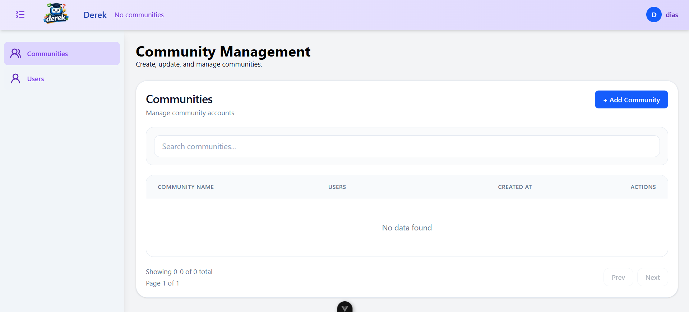
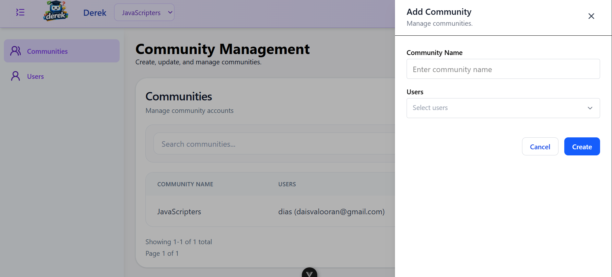
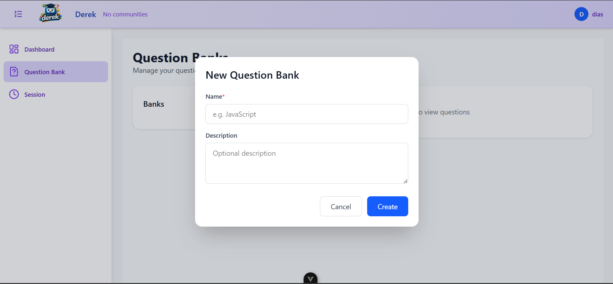
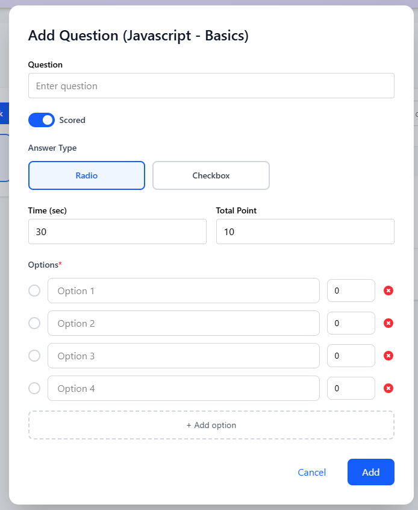
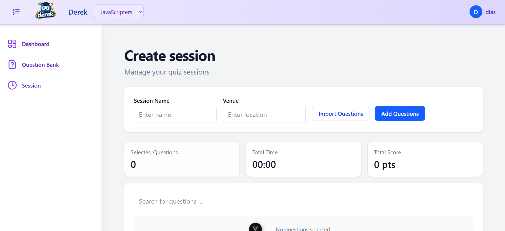
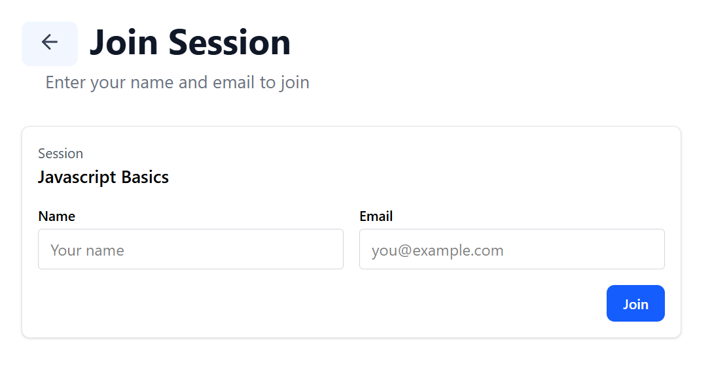
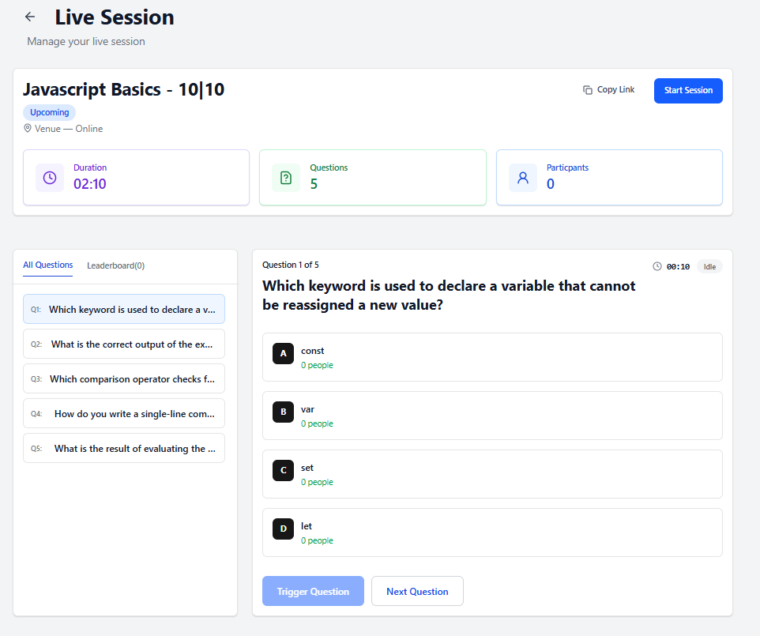
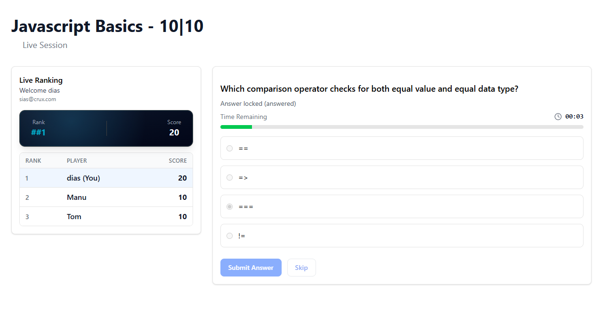
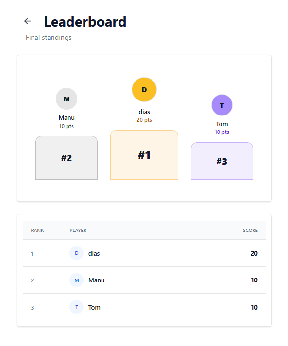

# Getting Started

Follow the steps below to create and run your first live quiz session in Derek.

## Prerequisites

Before continuing, ensure:

* Derek is installed and running.
* At least one platform admin user has been created using the setup instructions.

---

## 1. Login

Sign in using your platform admin account and access the administration area.

1. Log in to Derek.
2. Click your profile icon in the top-right corner.
3. Select **Admin Dashboard**.

---

## 2. Create a Community

Communities are used to organize trainers and participants.

1. Navigate to **Communities**.
2. Click **Create Community**.
3. Enter a **Community Name**.
4. Select users from the dropdown list.
5. Click **Create**.

---

## 3. Return to the Home Screen

After creating the community, return to the Home Screen and switch to the newly created community using the community selector in the top-left corner, next to the Derek logo.

---

## 4. Create a Question Bank

Question Banks help organize and reuse questions across multiple sessions.

1. Navigate to **Question Banks**.
2. Click **Create Question Bank**.
3. Enter:

   * **Name** (required)
   * **Description** (optional)
4. Click **Create**.

### Add Questions

1. Open the newly created Question Bank.
2. Click **Add Question**.
3. Configure:

   * Question Text
   * Score
   * * Answer Type (see [Answer Types](answer-type.md))
   * Time Limit
   * Options (for multiple-choice questions)
     * Mark the correct answer(s).
     * Optionally assign scores to individual answers to support partial credit.
4. Click **Add**.

Repeat this process to add as many questions as required.

---

## 5. Create a Session

Create a session using questions from the Question Bank.

1. Navigate to **Sessions**.
2. Click **Create Session**.
3. Enter the session details:

   | Field        | Description                           |
   | ------------ | ------------------------------------- |
   | Session Name | Name of the quiz session              |
   | Venue        | Physical or virtual venue information |

4. Add questions to the session by either:
   - Importing questions from an existing Question Bank, or
   - Creating new questions directly within the session using the **Add Question** button.
5. Click **Save**.

---

## 6. Start the Session

1. Open the session.
2. Click **Start Session**.
3. Share the session link or QR code with participants.
4. Wait for participants to join the session lobby before triggering questions.

---

## 7. Participants Join

Participants can join using:
* Name
* Email Address

No account creation is required.

---

## 8. Conduct the Live Quiz

1. Participants join the session and wait in the lobby.
2. The trainer monitors participants as they join.
3. Once participants have joined, the trainer triggers questions one at a time.
4. Participants submit their answers in real time.
5. Scores and leaderboard rankings update automatically after each question.

### Participant Experience

When a trainer triggers a question:

1. All participants in the session immediately receive the question.
2. A countdown timer starts and displays the remaining time available to answer.
3. Participants can select their answer and click **Submit Answer**.
4. Once an answer is submitted, it is locked and cannot be changed.
5. If the timer expires before an answer is submitted, the question is automatically locked.
6. Participants may choose to **Skip** a question instead of submitting an answer.
7. After the question ends, scores and leaderboard rankings are updated automatically.

---

## 9. End the Session

1. Click **End Session**.
2. Participants are redirected to the final leaderboard.
3. Rankings are calculated using:

   * Total Score
   * Response Accuracy
   * Response Time

---

🎉 Congratulations! You have successfully created and conducted your first live quiz session with Derek.